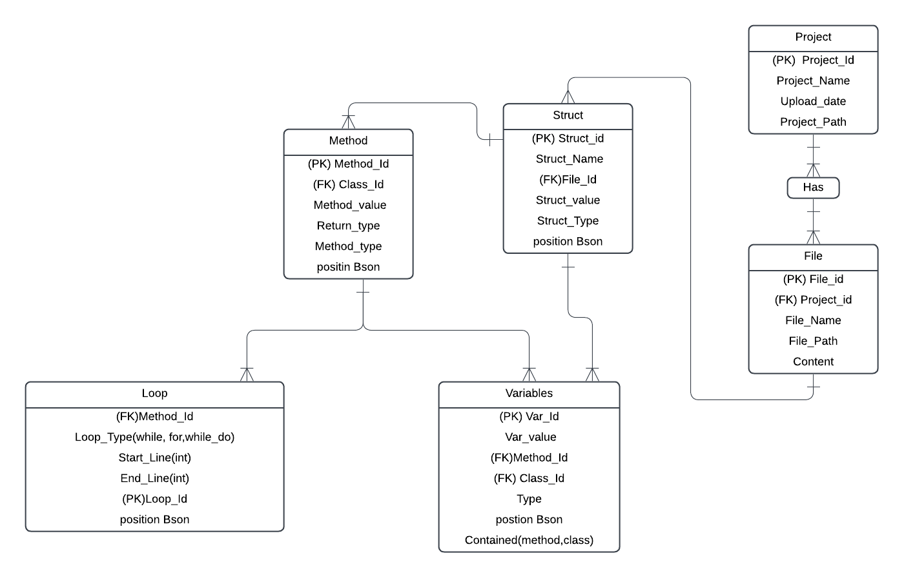

# Search Engine Project

## Overview
This project is a custom-built search engine designed to process Java files contained in a zip file. It parses the files, filters the extracted tokens, stores them in a database, and provides a JSON query language for performing complex search queries.

## Features
- **Zip File Parsing:** Automatically extracts and processes `.java` files from a zip file.
- **Token Filtering:** Passes tokens through a series of customizable filters to extrct more tokens help in searching.
- **Database Storage:** Stores filtered tokens in a database for efficient querying.
- **JSON Query Language:** Enables users to perform flexible and advanced search queries.

---

## How It Works

### 1. Input
- Users provide a zip file containing only Java files.

### 2. Token Extraction and Filtering
- Java files are parsed to extract tokens.
- Tokens are passed through a sequence of filters (e.g., removing keywords, special characters, or stopwords).

### 3. Database Storage
- Filtered tokens are stored in a structured database, optimized for search queries.

### 4. JSON Query Language
- Users can perform search operations using a custom JSON-based query language.
- Queries allow for conditions like "AND", "OR", and specific token matching.

---

## Usage

### Uploading Files
1. Use postman to uploade the ZIP file.
2. The system will automatically extract, parse, and filter the files.

### Performing Queries
- Use the JSON query language to perform searches. Below is an example query:
  ```json
  {
  "tables": [],
  "filters": [
    
  ],
  "pagination": {
  }
  }
  ```


## Architecture

### Database Design

---

## Technologies Used
- **JavaParser:** Used for extracting the tokens from Java files.
- **Database:** PostgreSQL for token storage and querying.
- **JSON:** Custom query language format.
- **Spring Boot:** IDE used for building the project.

---

